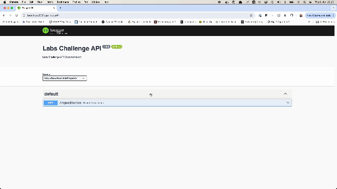

# Service Specification
Simple NodeJS application that provides a RESTful API to fetch the most popular repositories from GitHub. The service acts as a proxy to the GitHub Search API and fetches the repositories based on the query parameters.

Tech Stack: `NodeJS`, `Express`, `TypeScript`, `Jest`, `Supertest`, `Docker`

## Instructions

The service should be able to provide:

- A list of the most popular repositories, sorted by number of stars.
- An option to be able to view the top 10, 50, 100 repositories should be available.
- Given a date, the most popular repositories created from this date onwards should be returned
- A filter for the programming language would be a great addition to have.

## Project Setup

### Prerequisites

- Node.js
- npm
- Docker (for Docker setup)

### Local Setup

1. Install dependencies:

```bash
$ npm install
```

2. Create a `.env` file :

```bash
$ cp .env.example .env
```

3. Start the development server:

```bash
$ npm run dev
```

### Docker Setup

1. Build and run the Docker containers:

```bash
$ npm run docker:up
```

## The API Design

Based on the requirements, I implemented a repositories endpoint that accepts the following query parameters:

- `date`: (optional) The starting date for the repositories to be returned. Format: YYYY-MM-DD.
- `language`: (optional) Filter repositories by programming language.
- `sort`: (optional) Sort the repositories by the specified field. Default: stars.
- `order`: (optional) The order of sorting. Options: asc, desc. Default: desc.
- `page`: (optional) The page number for pagination. Default: 1.
- `limit`: (optional) The number of repositories to return per page. Default: 10.

The endpoint returns a list of repositories based on the query parameters in the following format:

```json
{
  "total": 100,
  "currentPage": 1,
  "totalPages": 10,
  "repositories": [
    {
      "id": 0,
      "name": "string",
      "full_name": "string",
      "html_url": "string",
      "description": "string",
      "stargazers_count": 0,
      "forks_count": 0,
      "language": "string",
      "created_at": "2024-06-06T17:44:54.686Z",
      "updated_at": "2024-06-06T17:44:54.686Z"
    }
  ]
}
```

The response format supports pagination, and the total field represents the total number of repositories that match the query parameters.

## Implementation Details

This API works as a proxy to the GitHub Search API. It fetches the most popular repositories based on the query parameters and returns the response in the specified format.

To achive this, I used a very simple structure with a single endpoint `/repositories` that handles the query parameters and fetches the repositories from the GitHub Search API.

I implmeneted a GithubClient class that handles the communication with the GitHub Search API. The class has a method `searchRepositories` that fetches the repositories based on the query parameters.

```typescript
public async getRepositories(query: QueryGH): Promise < GithubApiResponse > {
  const { date, language, sort = 'stars', order = 'desc', page = 1, limit = 10 } = query;

  const qParts = [];
  if(date) qParts.push(`created:>${date}`);
  if(language) qParts.push(`language:${language}`);

  const q = qParts.join(' ');
  const params = {
    q,
    sort,
    order,
    page,
    per_page: limit,
  };
  const url = `${GithubClient.BASE_URL}/repositories`;

  const response = await axios.get(url, { params });
  return response.data;
}
```

This provides a simple interface to fetch repositories based on the query parameters and simplifies the implementation of the `/repositories` endpoint.

The controller for the `/repositories` endpoint handles the query parameters and calls the `searchRepositories` method of the `GithubClient` class to fetch the repositories.

```typescript
export default async function handler(req: Request, res: Response, next: NextFunction): Promise<void> {
  const query = req.query as QueryParams;

  try {
    const githubClient = req.app.get('ghClient');
    if (!githubClient) throw new Error('GithubClient not initialized');

    const response = await githubClient.getRepositories({ ...params });
    res.status(200).json({ response });
  } catch (e: any) {
    next(createError(e?.response?.status || 500, e.message));
  }
}
```

## Testing

I implemented very simple integration tests for the `/repositories` endpoint using Jest and Supertest. The tests cover the basic functionality of the endpoint and test the response format and status code.

The results from GithubClient are mocked using `jest.mock` to avoid making actual requests to the GitHub Search API.

## The `/repositories` endpoint:

> Play with the endpoint here [http://localhost:8081/api-docs/](http://localhost:8081/api-docs/)

#### Example 1: Get the Most Popular Repositories Sorted by the Number of Stars

```bash
$ curl -X 'GET' \
  'http://${baseUrl}/repositories?sort=stars&order=desc' \
  -H 'accept: application/json'
```

#### Example 2: Get the Top 10 Most Popular Repositories

```bash
# By default sort is by stars

$ curl -X 'GET' \
  'http://${baseUrl}/repositories?limit=10' \
  -H 'accept: application/json'
```

#### Example 3: Get the Most Popular Repositories Created from a Specific Date Onwards

Get the most popular repositories created from a specific date onwards.

```bash
$ curl -X 'GET' \
  'http://${baseUrl}/repositories?date=2021-01-01' \
  -H 'accept: application/json'
```

#### Example 4: Get the Most Popular Repositories Created from a Specific Date Onwards and Filter by Language

```bash
$ curl -X 'GET' \
  'http://${baseUrl}/repositories?date=2021-01-01&language=python' \
  -H 'accept: application/json'
```

## Limitations:

As of now, the GitHub Search API may not respect parameters such as `page` and `per_page`, which can affect pagination.

> Try it out [Search API](https://api.github.com/search/repositories?q=created:2019-01-10&sort=stars&order=desc&page=1&per_page=10)

The above URL uses the following parameters:

- `q=created:2019-01-10`
- `sort=stars`
- `order=desc`
- `page=1`
- `per_page=10`

## OpenAPI Specification:


